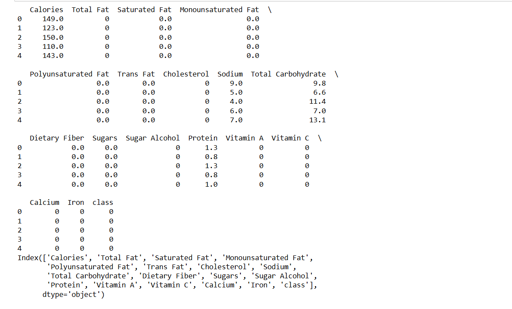
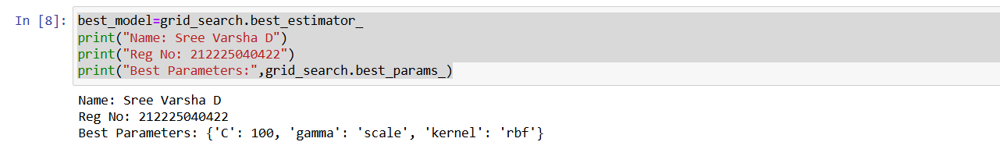
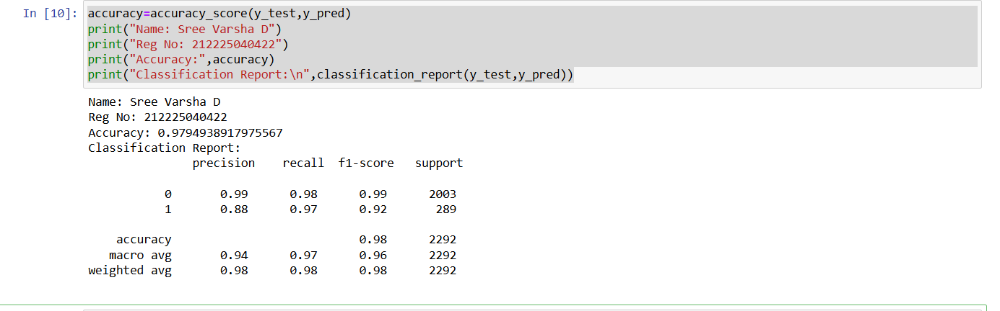
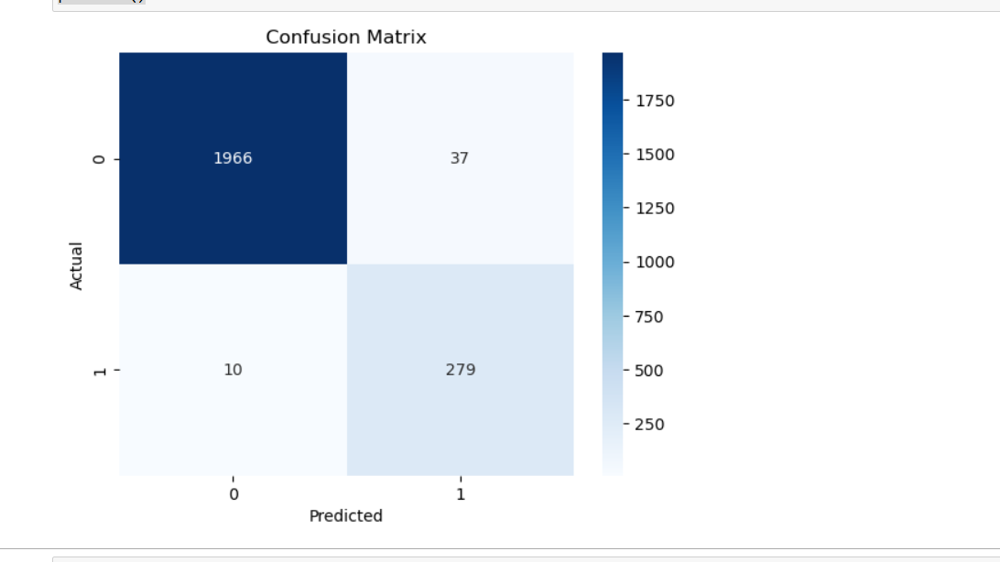

# BLENDED LEARNING
# Implementation of Support Vector Machine for Classifying Food Choices for Diabetic Patients

## AIM:
To implement a Support Vector Machine (SVM) model to classify food items and optimize hyperparameters for better accuracy.

## Equipments Required:
1. Hardware – PCs
2. Anaconda – Python 3.7 Installation / Jupyter notebook

## Algorithm
1. Import the required libraries such as pandas, matplotlib, seaborn, and scikit-learn modules.

2. Load the dataset food_items_binary.csv using pandas.

3. Display the first few rows and column names of the dataset to understand the data.

4. Select nutritional attributes (Calories, Total Fat, Saturated Fat, Sugars, Dietary Fiber, Protein) as input features.

5. Select the class column as the target variable.

6. Split the dataset into training set (70%) and testing set (30%) using train_test_split.

7. Standardize the feature values using StandardScaler to normalize the data.

8. Create an SVM (Support Vector Machine) model and define hyperparameters (C, kernel, gamma) for tuning.

9. Use GridSearchCV with cross-validation to find the best parameters and train the model.

10. Predict the test data, calculate accuracy, classification report, and confusion matrix, and visualize the confusion matrix using a heatmap.

## Program:
```
/*
Program to implement SVM for food classification for diabetic patients.
Developed by: Sree Varsha D 

import pandas as pd
import matplotlib.pyplot as plt
from sklearn.metrics import accuracy_score,classification_report,confusion_matrix
from sklearn.model_selection import train_test_split,GridSearchCV
from sklearn.preprocessing import StandardScaler
from sklearn.svm import SVC
import seaborn as sns
data =pd.read_csv('food_items_binary.csv')

print(data.head())
print(data.columns)

features=['Calories','Total Fat','Saturated Fat','Sugars','Dietary Fiber','Protein']
target=['class']

x=data[features]
y=data[target]
x_train,x_test,y_train,y_test=train_test_split(x,y,test_size=0.3,random_state=42)

scaler=StandardScaler()
x_train=scaler.fit_transform(x_train)
x_test=scaler.transform(x_test)

svm=SVC()
param_grid={
    'C':[0.1,1,10,100],
    'kernel':['linear','rbf'],
    'gamma':['scale','auto']
}

grid_search=GridSearchCV(svm,param_grid,cv=5,scoring='accuracy')
grid_search.fit(x_train,y_train)

best_model=grid_search.best_estimator_
print("Name: Sree Varsha D")
print("Reg No: 212225040422")
print("Best Parameters:",grid_search.best_params_)

y_pred=best_model.predict(x_test)

accuracy=accuracy_score(y_test,y_pred)
print("Name: Sree Varsha D")
print("Reg No: 212225040422")
print("Accuracy:",accuracy)
print("Classification Report:\n",classification_report(y_test,y_pred))

conf_matrix=confusion_matrix(y_test,y_pred)
sns.heatmap(conf_matrix,annot=True,fmt="d",cmap="Blues")
plt.xlabel("Predicted")
plt.ylabel("Actual")
plt.title("Confusion Matrix")
plt.show()


RegisterNumber: 212225040422 
*/
```

## Output:





## Result:
Thus, the SVM model was successfully implemented to classify food items for diabetic patients, with hyperparameter tuning optimizing the model's performance.
